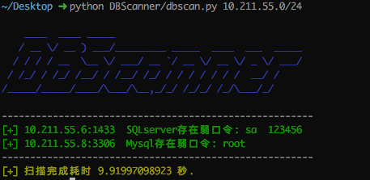
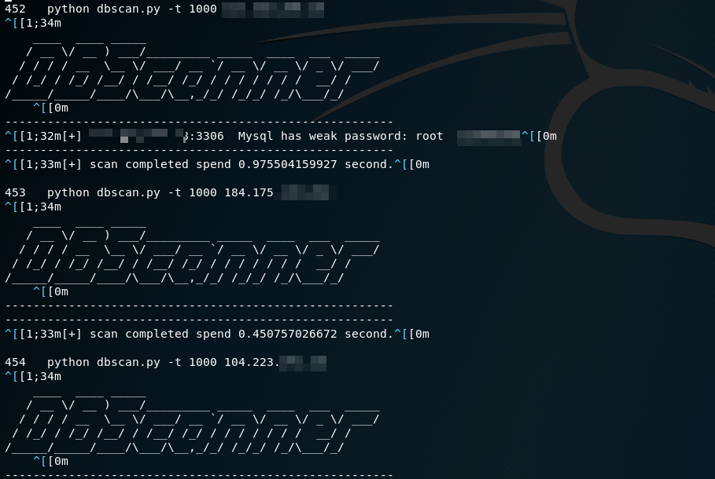

# DBScanner_Batch
自动扫描内网常见sql、no-sql数据库脚本(mysql、mssql、oracle、postgresql、redis、mongodb、memcached、elasticsearch)，包含未授权访问及常规弱口令检测

---

### 修改说明

在源代码的基础上,添加了批量扫描脚本.原理是python的subprocess调用以及文件读写

当然这种调用思路可以适配到任何扫描脚本中,达到不修改源码的情况下批量调用

由于python2的字符编码原因,源码中中文输出修改为英文

### 使用说明

1.进行扫描ip的设置,存放路径为ip.txt

2.运行batch.py(代码中设置线程1000,超时间隔120s)

### 效果

>  python batch.py > res.txt

所有输出都得到记录,可以通过字符串搜索Mysql,Redis等字符串查看结果

### 待完善

懒得弄了,仅提供思路,欢迎修改补充

1.格式话输入参数,并提供命令界面.可以使用argparse,但是我推荐@click这个python包

2.输入文件提取,只显示扫描成功结果,两种思路

- 处理完毕后正则提取
- 直接修改源码只输出扫描成功项

